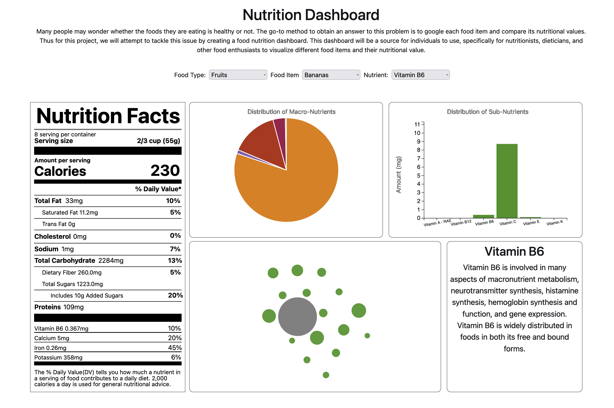
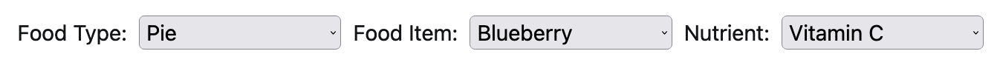
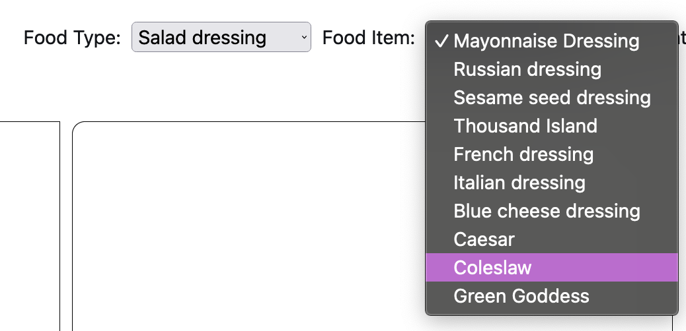
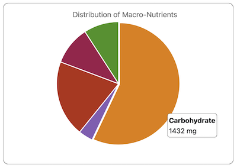
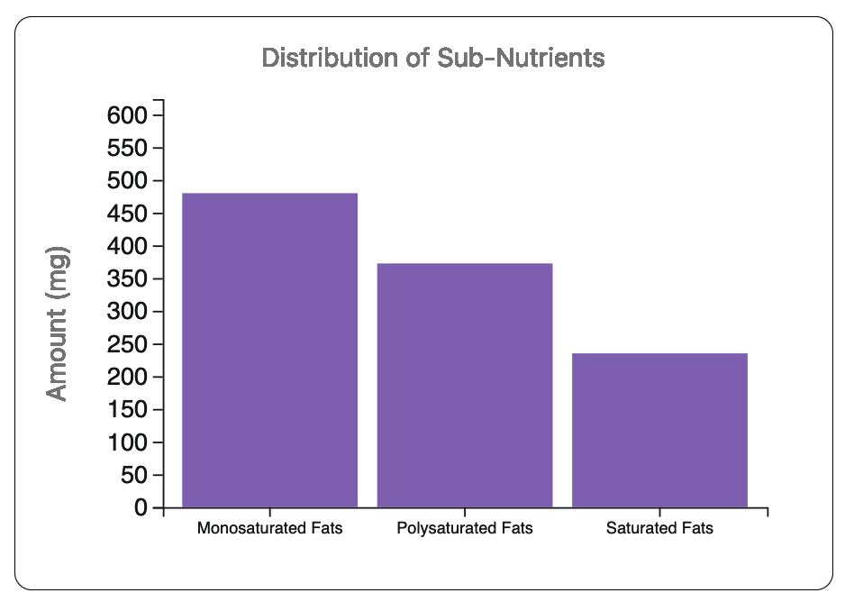
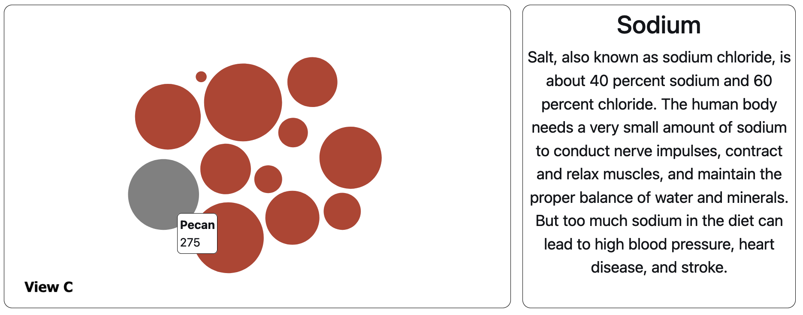
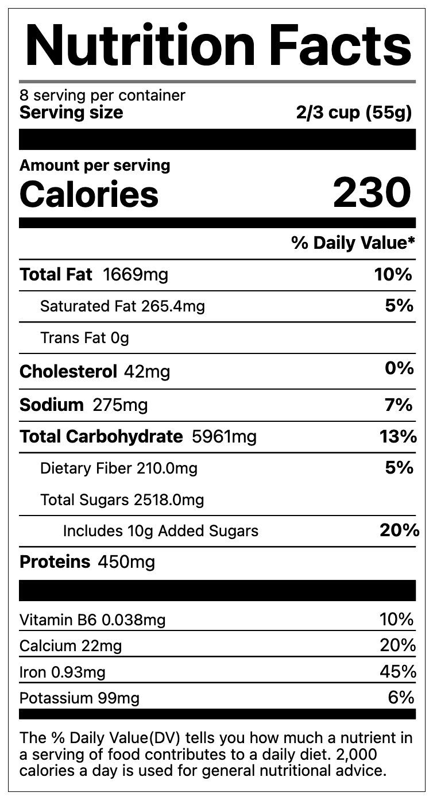

# Nutrition Dashboard
## Team: Padma Prabagaran, Manali Redkar, Anjali Singh, Pallavi Koyye

## Overview

For this project we have implemented a nutrition dashboard with the help of data visualization techniques and the D3 library. Many people may wonder whether the foods they are eating is healthy or not. The go-to method to obtain an answer to this problem is to google each food item and compare its nutritional values. Our solution to this drawback is a dashboard that consists of nutritional information about all foods in one place. This dashboard will be a source for individuals to use, specifically for nutritionists, dieticians, and other food enthusiasts to visualize different food items and their nutritional value.
## Data
- Source: https://corgis-edu.github.io/corgis/csv/ingredients/
- Preprocessing: Since some of the attributes in the data were in different units we decided to convert all of them to milligrams using python. We also only chose a subset of the data to use in our dashboard for the ease of implementing it.
## Tasks
## Idioms
- interface
- implemented viz
  - UI Widgets
  
  
  - View A
  
  - View B
  
  - View C
  
  - View D
  
  
- interactions?
- screenshots
## Reflection

## Team Workload
- Padma:
- Manali:
- Anjali:
- Pallavi:

