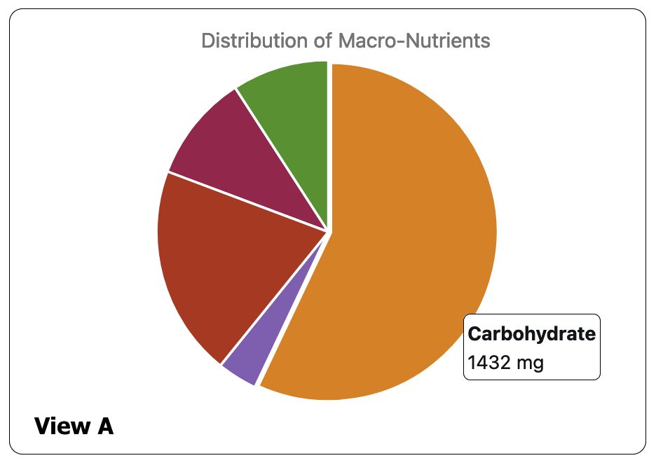

# Nutrition Dashboard
## Team: Padma Prabagaran, Manali Redkar, Anjali Singh, Pallavi Koyye

## Overview

For this project we have implemented a nutrition dashboard with the help of data visualization techniques and the D3 library. Many people may wonder whether the foods they are eating is healthy or not. The go-to method to obtain an answer to this problem is to google each food item and compare its nutritional values. Our solution to this drawback is a dashboard that consists of nutritional information about all foods in one place. This dashboard will be a source for individuals to use, specifically for nutritionists, dieticians, and other food enthusiasts to visualize different food items and their nutritional value.
## Data
- Source: https://corgis-edu.github.io/corgis/csv/ingredients/
- Preprocessing: Since some of the attributes in the data were in different units we decided to convert all of them to milligrams using python. We also only chose a subset of the data to use in our dashboard for the ease of implementing it.
## Tasks
## Idioms
The interface consists of 4 main visualizations that provide different nutritional insights. The charts used are:
  1. Pie chart
  2. Bar chart 
  3. Circular packing chart 
  4. Nutritional label 
 
  The first visualization, which is a pie chart that shows the macronutrient information of the food item selected in the second dropdown menu. This visualization will give the user a high-level breakdown of the distribution of main nutrients in the food item. 
  The second visualization, which is a bar chart that is linked with the pie chart from the first. When a sector on the pie chart is clicked on, the visualization to the right is updated with a bar chart that gives the detailed nutrient information of the specific macronutrient. For example, if the Vitamins and Minerals section is clicked on, the visualization on the right will show a bar chart populated with the different amounts of vitamins and minerals such as Vitamin A, Vitamin C, Zinc, etc found in the food item selected on the second dropdown menu. This visualization gives users a much deeper understanding of the specific nutrients found in the food item.
	The third visualization in our dashboard is a circular packing chart that shows the specific nutrient information (chosen from dropdown 3). Usually, one of the biggest questions on a user's mind while looking at the nutrition of a specific food item would be if there is a healthier alternative. This visualization attempts to answer this question. Based on the food category selected in dropdown 1, this visualization compares the value selected in dropdown 3 among the different items in the food category. The food selected in the second dropdown will be highlighted in this chart for ease of comparing it to others. When the user hovers over a circle the circle is highlighted by increasing its border and the numerical data of the value selected in the 3rd dropdown is displayed in the circle.
  The fourth visualization in our dashboard mimics the nutrition label that can be found on most food packages. This visualization is also our “innovative view”.  This is an extension of an existing technique and the aim of this visualization is to give the users a brief rundown of the most important nutrients in each food item. The plan is to make this visualization using just rectangles and text. 

  
   
  
  
  
## Reflection

Initially, our project had a proposal that displayed four svg elements with their respective charts. When working on the project, we had some issue displaying the pie chart inside the respective svg element and we were not then able to correspond the pie chart with the stored data. The nutrition label was not able to display either in the WIP as there was an issue the team ran into. Coming to the final product, all visualizations were displayed in their respective svgs and all were interconnected. The team was able to integrate the data to be read by each visualization performing their respective functionalities. In addition, the team added a new svg displaying additional information.
	Our goals stayed persistent throughout the project as we had initially stated a clear idea. The proposal was realistic because it allowed users to clearly navigate throughout the dashboard and understand the purpose of each element. In addition, the schedule was concise and retained clear goals and tasks to be completed each week. In order to avoid miscommunication, the team stated the tasks to be completed by each member. 
	There were multiple challenges that occurred throughout the project. For instance, when trying to add a description inside an svg, we were unable to wrap the text. With some research and guidance, we were able to resolve this issue. There were not features that we wanted to implement but were not able to; our team was able to present all necessary information we had proposed. We had one workaround we did when creating the info text. To display the information in an organized manner, we created a dictionary with all the information and it was able to be wrapped in the svg. 
	Something we would do differently in the future, is add a line chart within the nutrition label to indicate comparisons between food items. Furthermore, we could also display related videos based on the type of nutrient the user selects to gather more information.

## Team Workload
The team decided to divide the project into 4 parts. As we proposed four forms of visualization, each member took the responsibility of taking one visualization each. The first visualization was a pie chart that was completed by Anjali, the second was a bar chart completed by Manali, the third was a circular packing chart completed by Padma and the fourth was a nutrition label completed by Pallavi. All visualizations read data from the csv files and the dropdowns are dependent on each other.
In the pie chart, Anjali worked on taking data from the second dropdown to display the portions of carbohydrates, lipids, protein, minerals and vitamins that consist within the food type chosen from drop down 1 and the food item chosen from drop down 2. She also worked on displaying a detailed description when the user hover over each portion of the pie chart. 
The bar chart is connected to the pie chart, hence Manali worked on taking the user click performed on the pie chart and displaying a bar chart with the specific types of macronutrients within that portion of the pie chart.
The circular packing chart is connected to the bar chart and the third drop down, hence Padma worked on displaying the food items in circular forms for the user to compare and visualize items consisting of the macronutrient selected from the bar chart. As the user hovers over the circles, a detailed description is displayed. Padma also worked on 
The nutrition label is connected with the circular packing chart, hence Pallavi worked on displaying the respective number of mg consisting within the food item selected. In addition, she created the label with a detailed description.

